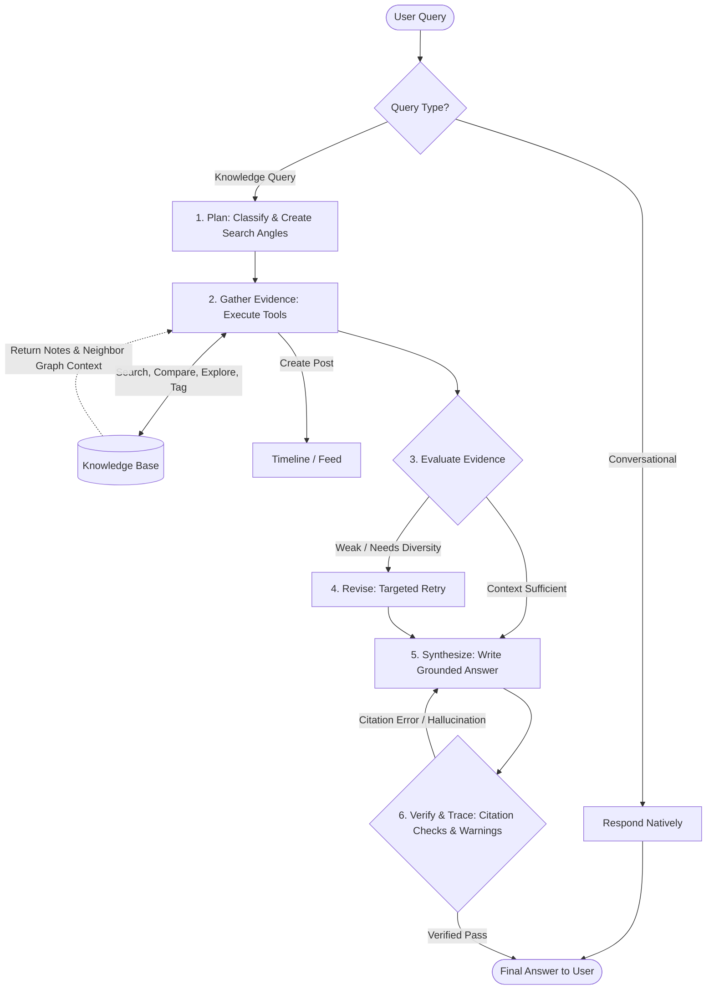
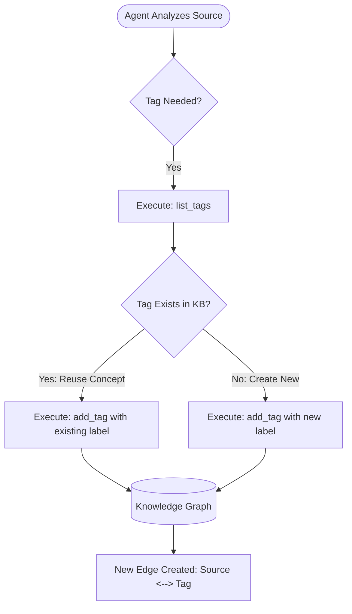
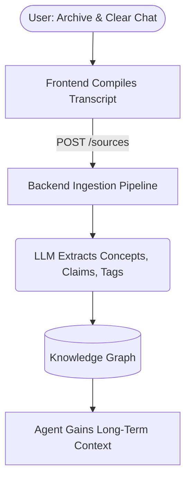

# Agent Workflow

The SecondBrain chat agent is powered by an LLM (Claude by Anthropic) equipped with a set of tools to query your personal knowledge base.

## Core Flow

1. **User Query**: The user asks a question in the chat interface.
2. **Context Retrieval**: 
   - For conversational queries (e.g., greetings), the agent responds natively without tool use.
   - For knowledge queries, the agent determines the appropriate tools to use to fetch information.
3. **Agent Tools**: The LLM is provided with seven primary tools:
   - `search_knowledge_base`: Search saved notes and graph-connected context.
   - `get_source_detail`: Fetch the full content and enrichment fields for a specific source.
   - `explore_graph_connections`: Explore concepts and source-to-source connections in the knowledge graph.
   - `compare_sources`: Compare multiple saved sources by summary, concepts, claims, and overlap.
   - `list_tags`: List all tags currently used in the knowledge base graph to find ones to reuse.
   - `add_tag`: Add a new tag to a specific source in the knowledge base, updating the graph connections.
   - `create_post`: Publish a synthesized thought or summary directly to the user's home timeline.
4. **Tool Execution**: The LLM can execute up to a maximum number of agent turns (e.g., 3 turns) to gather all necessary context before forming a final answer.
5. **Answer Generation**: The agent synthesizes the retrieved context and generates a response, citing sources inline (e.g., `[1]`).

## Streaming Support
The agent supports streaming token-by-token responses to the frontend using Server-Sent Events (SSE), yielding `tool_call` markers when invoking knowledge-base functions.

## Neighbor Graph Context
During a query, the backend utilizes the knowledge graph to extract a **Neighbor Graph Context**. When a relevant source or concept is found, the system fetches adjacent nodes and their connections. This "neighbor graph" provides the LLM with a macro-level understanding of how specific notes relate to broader concepts or other documents, enabling it to synthesize more holistic answers.

## Tagging & Graphification Workflow
When the agent determines that a source is missing context or could be better categorized, it can actively expand the knowledge graph using a specific tagging loop:

This ensures that the agent doesn't hallucinate redundant tags (e.g., creating `ai-models` when `ai-architecture` already exists) and forces it to maintain a tightly interconnected knowledge graph.

## Long-Term Memory (Chat Archival)
The agent features a unique "Long-Term Memory" loop. When a user chooses to **Archive & Clear Chat History** in the UI, the session doesn't just disappear. 
Instead, the entire conversation transcript is compiled into a markdown document and submitted to the backend's core ingestion pipeline. The LLM processes this transcript exactly like a user-uploaded note—extracting concepts, tags, and claims—and plots the conversation into the Knowledge Graph. This allows the agent to naturally "remember" past discussions during future queries without overwhelming its immediate context window.

