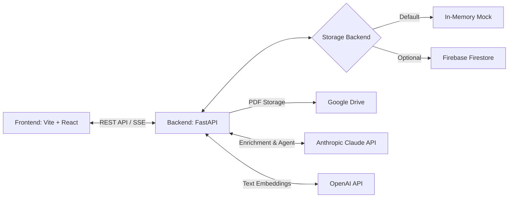

# System Architecture

SecondBrain is built with a decoupled frontend and backend architecture, utilizing external APIs for LLM capabilities, embeddings, and optional cloud storage.

## Components

### Frontend
- **Framework**: React via Vite.
- **Role**: Provides the user interface for uploading documents, viewing the knowledge graph, and chatting with the agent.

### Backend
- **Framework**: FastAPI (Python).
- **Role**: Serves the REST API endpoints, handles ingestion pipelines, chunking, embedding generation, and LLM agent orchestration.

### AI Integration
- **LLM**: Anthropic Claude API for rich text extraction, metadata generation (summaries, concepts), and the conversational agent. (Includes local fallback).
- **Embeddings**: OpenAI API for vectorizing text chunks for semantic search, and powering the Knowledge Graph's Semantic Entity Resolution. (Includes deterministic local fallback).

### Storage Layer
- **Default**: In-memory mock data (designed for local hackathon/MVP development).
- **Cloud Backend**: Google Firebase Firestore can be configured via environment variables to persist accounts, sources, chunks, posts, and graph edges.
- **File Storage**: Google Drive is used for storing the original raw PDFs.

## Deployment Strategy
The app is designed to run locally with `uvicorn` and `npm run dev` but can easily be deployed to platforms like Render, Heroku, or Google Cloud Run, provided the appropriate environment variables (`ANTHROPIC_API_KEY`, `OPENAI_API_KEY`, `FIREBASE_SERVICE_ACCOUNT_JSON`, etc.) are configured.
