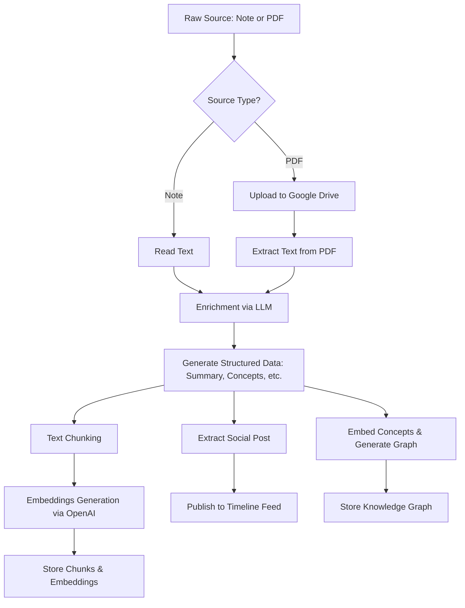

# Ingestion Workflow

The ingestion workflow is responsible for taking a raw source (text note or PDF document) and converting it into a rich, queryable format within the SecondBrain.

## Stages of Ingestion

1. **Validating**: Verifies the input format (note text or PDF file upload) and target account.
2. **Uploading**: If the source is a PDF, the raw file is uploaded to Google Drive. The Drive link is saved as metadata.
3. **Extracting/Reading Text**:
   - Note: The raw text is read directly.
   - PDF: The text is extracted from the uploaded file bytes.
4. **Enriching**: The raw content is sent to an LLM (Claude) to generate structured memory:
   - Summary
   - Key Ideas
   - Concepts
   - Claims
   - Questions
   - A generated social media post
5. **Embedding**: The enriched sections and raw notes are chunked into smaller pieces (e.g., max 1400 characters). These chunks are then embedded using an embedding model (e.g., OpenAI text-embedding model or local fallback) to create vector representations for semantic search.
6. **Graphing**: Extracted concepts are converted into vector embeddings. The backend then uses semantic similarity to merge them into existing concept nodes, preventing fragmentation. Finally, the source document is linked to these concepts and tags, creating a clean web of interconnected knowledge.
7. **Complete**: The source is marked as "ready" and is available for retrieval by the chat agent and viewing in the UI.
