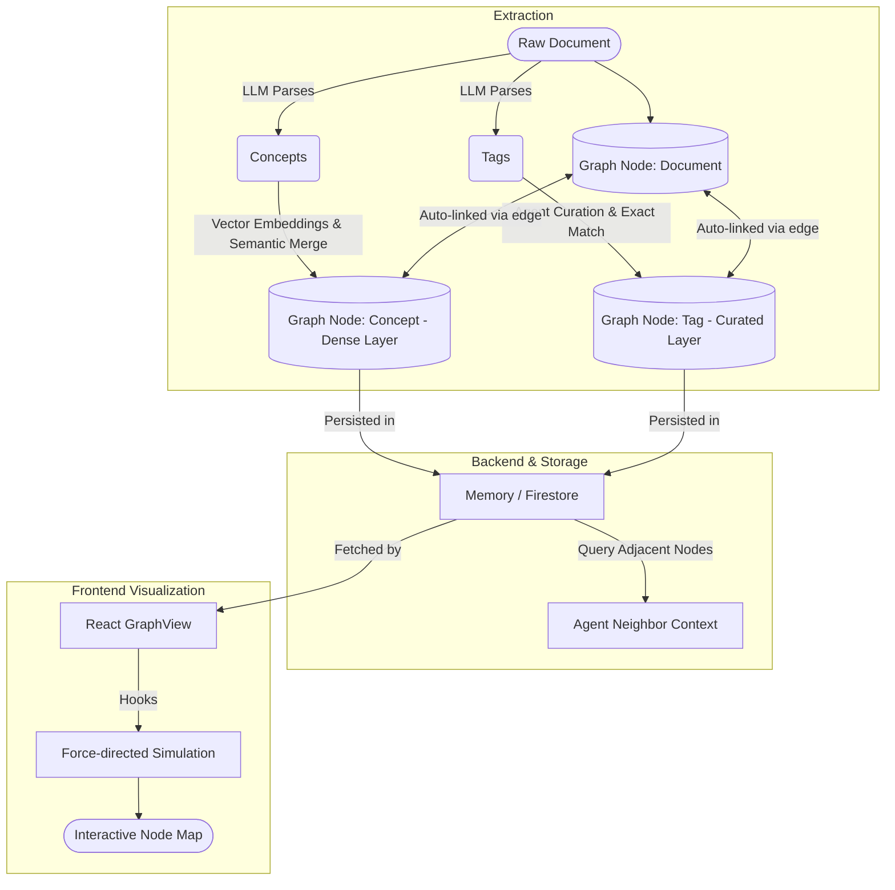

# Knowledge Graph

The core feature of SecondBrain is its ability to build, store, and visualize a Knowledge Graph based on the notes and documents you ingest.

## 1. Graph Generation
The knowledge graph is composed of three node types: Sources, Concepts, and Tags. It is designed with two distinct organizational layers.

**Concrete Example:** If you upload a note about *"Using React hooks to fetch data from a REST API"*, the LLM fills out two separate buckets simultaneously:
1. **Concepts**: The granular ingredients (`"React Hooks"`, `"REST API"`, `"Data Fetching"`).
2. **Tags**: The broad filing cabinets chosen from your existing database (`"web-development"`, `"javascript"`).

### The Dense Layer (Concepts)
During ingestion, the LLM automatically extracts up to 8 granular entities (e.g., "FastAPI", "Vector Embeddings") per document. 
- **Semantic Entity Resolution**: When concepts are extracted, they are run through an embedding model. The backend uses vector cosine similarity to semantically match and merge new concepts into existing concept nodes. This prevents fragmentation (e.g., automatically merging "Attention Mechanism" with "Attention mechanisms in LLMs").
- **Purpose**: Creates a smart, dense, bottom-up web of specific ideas linking documents together. Represented as the smallest nodes in the visualization.

### The Curated Layer (Tags)
Tags are broad overarching topics (e.g., `web-development`, `artificial-intelligence`). Documents only get 2-4 tags.
- **Deduplication via Curation**: Tags bypass vector embeddings entirely. Instead, the Agent actively manages the tag list by explicitly querying existing tags in the database to reuse identical labels, ensuring strict top-down categorization.
- **Purpose**: Creates a clean, highly curated, top-down categorization layer. Represented as medium-sized nodes in the visualization.

- **Edges**: The backend automatically links the source document node (largest nodes) to all of its concept and tag nodes. Over time, as multiple documents share the exact same concepts and tags, a web of interconnected knowledge is formed.

## 2. Graph Storage
Graph nodes and edges are persisted via the storage abstraction layer (`storage.py`). 
- In the default local mode, they are stored in memory (`MemoryStorageBackend`).
- When configured for the cloud, they are stored in Firebase Firestore (`FirestoreStorageBackend`), enabling persistent and scalable graph queries.

## 3. Graph Visualization
The frontend provides a rich, interactive visualization of the knowledge graph via the `GraphView` component (`src/components/GraphView.tsx`). 
- **Physics Simulation**: The graph relies on custom hooks (e.g., `useGraphSimulation`) to run a force-directed layout that spatially organizes nodes.
- **Interactions**: Users can pan, zoom, and filter nodes by text.
- **Neighbor Highlighting**: Clicking or hovering over a node highlights its immediate neighbors (adjacent concepts or sources), making it easy to discover related documents.

## 4. Agent Context
As documented in the [Agent Workflow](agent_workflow.md), the LLM agent also queries this graph dynamically to build "Neighbor Graph Context" when answering questions, allowing it to synthesize answers that draw from structurally related ideas, even if they aren't explicitly linked in the text.
